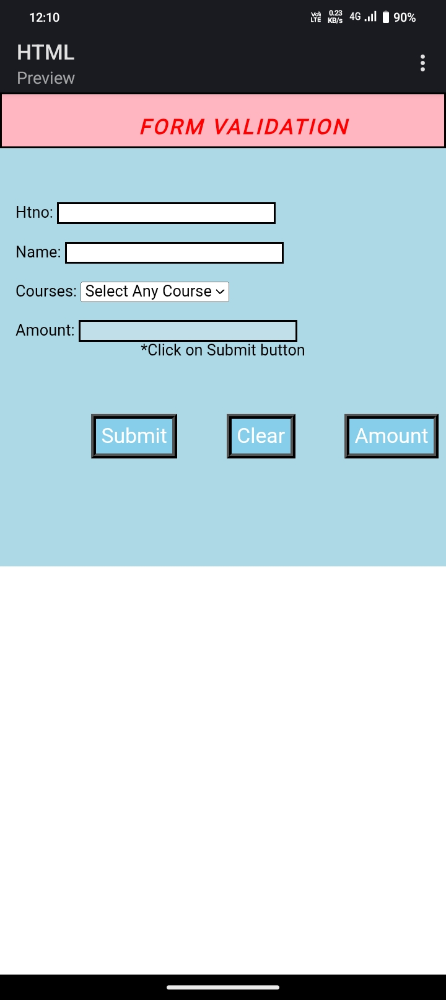
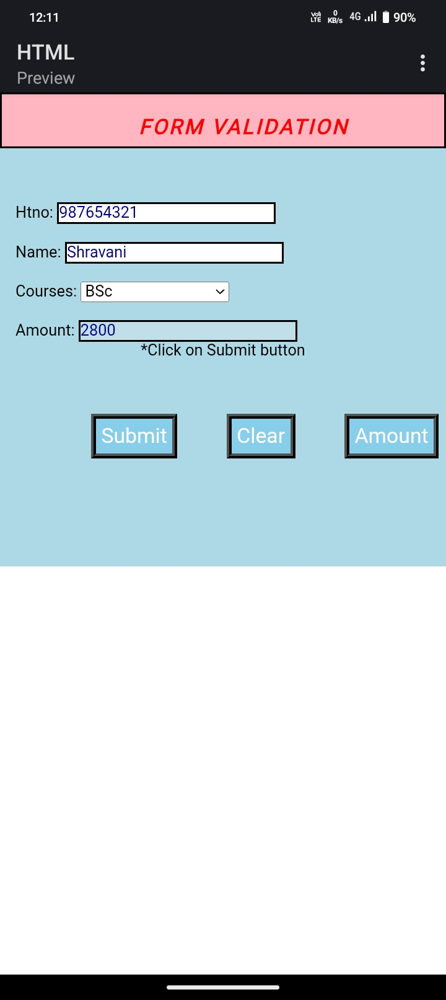

# Form-Validation-

This project is a simple web-based registration form that includes form validation, course-based fee display, and a print feature. Users can enter their **Hall Ticket Number**, **Name**, and choose a **Course** from a dropdown. After clicking the **Submit** button, the corresponding **fee amount** for the selected course is automatically shown in a text box. The user is then redirected to a new page displaying all submitted information, which can be printed.

## Features

- Input validation for:
  - Hall Ticket Number
  - Name
  - Course selection
- Displays fee amount dynamically based on selected course
- Submit button that:
  - Validates form input
  - Shows the fee
  - Redirects to a new page with submitted details
- New page includes:
  - Hall Ticket Number
  - Name
  - Selected Course
  - Displayed Fee Amount
- Print button to print the full registration summary from the new page

## How It Works

1. **User Input**: The user fills in:
   - Hall Ticket Number
   - Name
   - Selects a course (e.g., Web Development, Data Science, UI/UX)
2. **Submit Action**:
   - Input is validated.
   - Fee is displayed based on course selection.
3. **Printing**:
   - On the same page, a **Print** button is available.
   - User is redirected to a new page with all their submitted info.
   - Clicking it opens the browser print dialog to print the registration summary.

## Technologies Used

- HTML
- CSS
- JavaScript

## Example Course and Fee Structure

| Course             | Fee Amount |
|--------------------|------------|
| Bsc                | ₹2,800     |
| BCom               | ₹2,600     |
| BBA                | ₹3,600     |
| BCA                | ₹3,050     |

> Note: You can customize the course list and fee structure in the JavaScript file.

## Screenshots 
1. Blank Registration Form (No Inputs Yet)      

2. Filled Form with Inputs + Fee Displayed.
  

3. Confirmation/ Print Page.
   
   
You can see how the form works dynamically by filling in your details — the fee is shown instantly based on course selection before submission.
